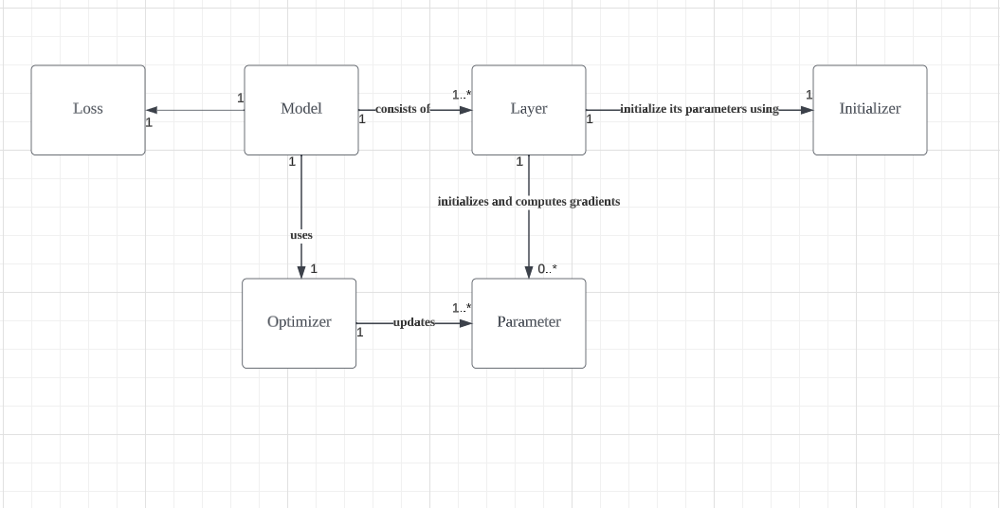

# Toy DL Framework

This repository implements a deep learning algorithms from scratch, using Numpy only. Some characteristics are: 

1. Mix of PyTorch and Keras - can use fit API like Keras to quickly fit a model, or write a train loop from scratch in PyTorch style
2. No computation graph - no need to care about tracking gradients and scopes; instead, create a layer by yourself without effort
3. Simple, yet low-level - written only using pure Python and Numpy; you get a low-level understanding of deep learning architectures easily; it is suitable for learning purposes

## Layers Implemented / To-Be Implemented
Currently, we have the following layers:
- Linear (Dense)
- ReLU
- SoftmaxWithCrossEntropy
- Embedding
- Conv2D
- SimpleRNN

Each of these layers is implemented as a class that has both forward and backward methods, enabling forward and backward propagations. We also implement several optimizers including SGD, Momentum, and Adam. Several initializers are also available.

We plan to add more layers including:
- Batch Normalization
- Dropout
- Attention, Multi-head Attention
- Conv1D

## Notes on Architecture

The framework consists of 6 main classes:
1. Model
2. Layer
3. Optimizer
4. Loss
5. Initializer

Each of these can be extended for customization. 

## Details on each Layer
.. to be added